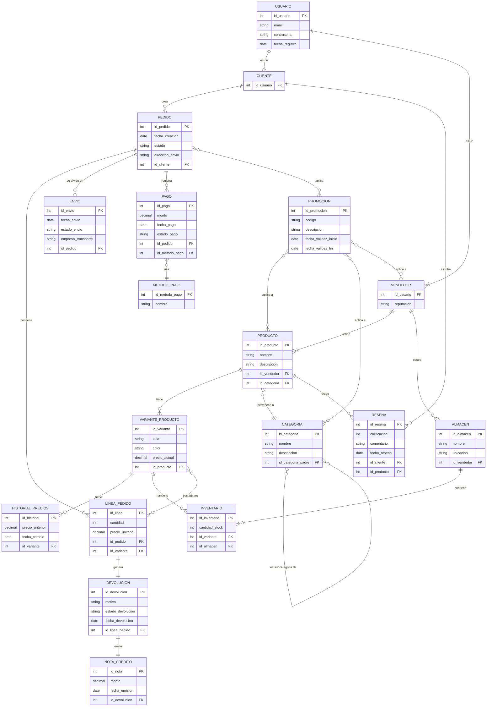

# Resolución

## Desarrollo escrito
1. [Identificación de Entidades](/021_entidades.md)
2. [Relaciones y Verbos](/022_relaciones.md)
3. [Atributos](/023_atributos.md)
4. [Identificadores](/024_identificadores.md)
5. [Jerarquías de Generalización](/025_jerarquias.md)

## Diagrama

[source](/026_diagrama.mermaid)